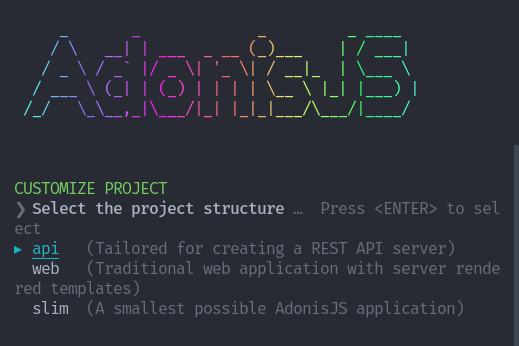

# api_adonis
Create an API to use in Insterest project -> an Angular project that I working on

* start your project with the following commands
```
npm init adonis-ts-app@latest .
```
.

* Choose te API option
* Answer true for the **eslint** and **prettier** extensions.

At the end of this installation, use the following command to run your Adonis API:

```
node ace serve --watch
```
The usual adress of the API is the localhost:3333. Access to visualize the following message on your browser:

```
{
  "hello": "world"
}
```
## Install lucid ORM

```
npm i @adonisjs/lucid
```
Now we need to configure lucid:
```
node ace configure @adonisjs/lucid
```
Choose the **SQLite** database and **In the terminal** option after the  installation is complete.

Configure **cors.ts** file at **config** directory.

```
enabled: (request) => request.url().startsWith('/api'),

```
Now we have access to URLs that starts with **/api**.
